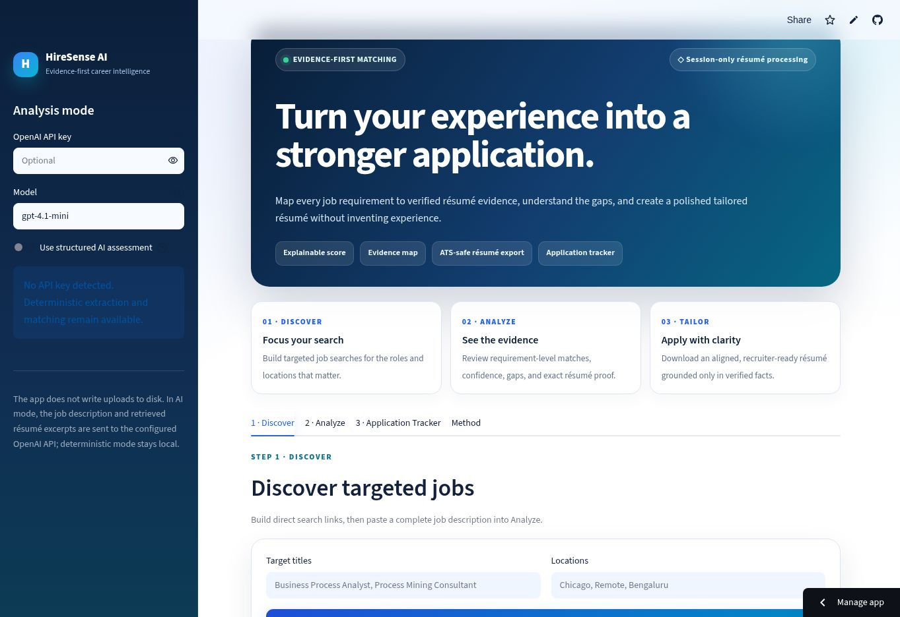
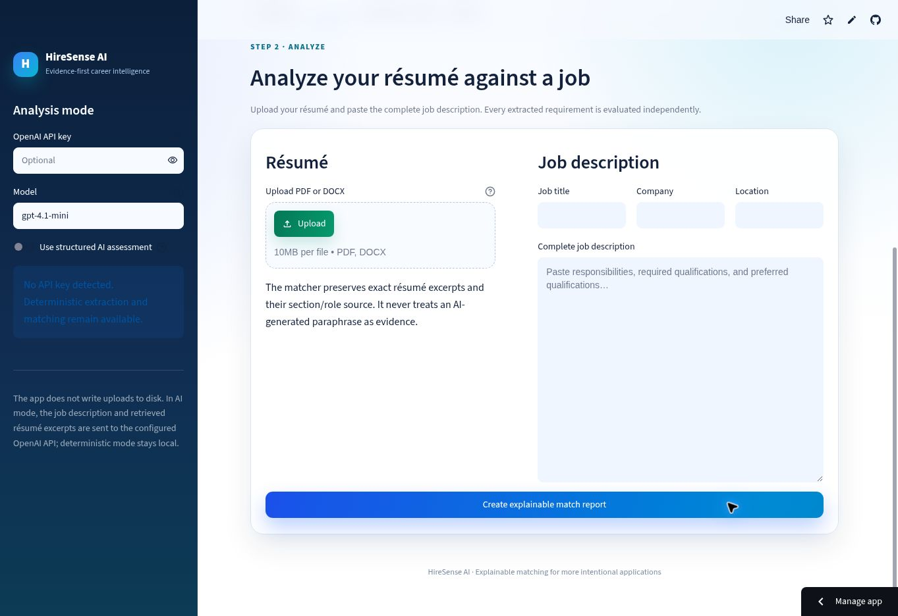
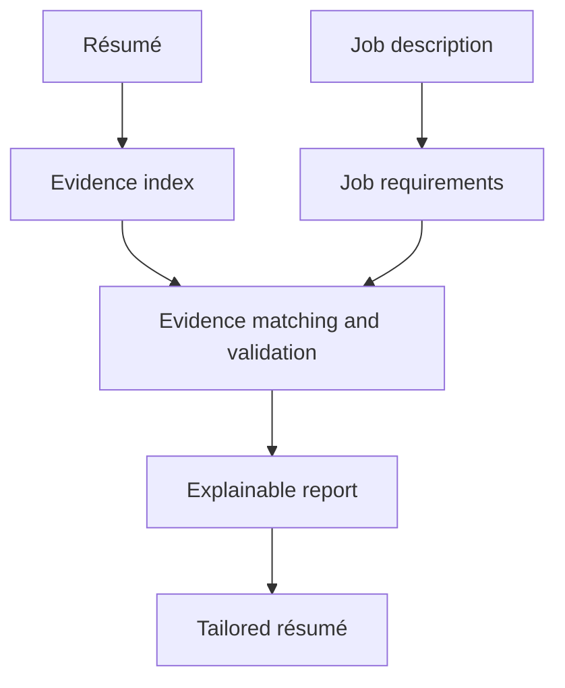

<div align="center">


# HireSense

### Understand your fit. Improve with evidence. Apply with confidence.

HireSense turns a résumé and job description into a clear match report, practical improvement priorities, and a professionally formatted tailored résumé.

[](https://hiresense-ai-shro.streamlit.app/)
[](https://www.python.org/)
[](https://streamlit.io/)

</div>



## What is HireSense?

Most résumé tools return a score without explaining it. HireSense shows exactly **which job requirements are supported, what résumé evidence proves them, and what needs attention**.

It helps users answer three questions:

1. **Am I a strong fit for this job?**
2. **What should I improve before applying?**
3. **How can I tailor my résumé without inventing experience?**

## How it helps

| Audience | Value |
|---|---|
| Job seekers | Understand fit, focus improvements, and create a tailored résumé faster |
| Career coaches and universities | Provide structured, evidence-based application guidance at scale |
| Recruiters and hiring teams | Receive clearer résumés with more relevant and supportable experience |
| Business and technical stakeholders | Review a practical explainable-AI product with transparent scoring and guardrails |

HireSense can reduce repetitive résumé review, improve application quality, and make career guidance more consistent—while keeping the candidate responsible for the final content.

## A simple three-step workflow

### 1. Analyze

Upload a PDF or DOCX résumé and paste the complete job description. HireSense evaluates each requirement independently.

### 2. Understand

Review the overall match, strongest evidence, priority gaps, category coverage, and the exact résumé text supporting each result.

### 3. Tailor and improve

Generate a polished résumé using only supported experience. Review the changes, then download Word and PDF versions.



## What users receive

- A clear résumé-to-job match score
- Direct, related, uncertain, and missing requirement classifications
- Exact résumé evidence for every supported conclusion
- Priority recommendations instead of an overwhelming list
- Supported keyword guidance
- Recruiter-ready Word and PDF résumé exports
- Downloadable match-report PDF and evidence CSV
- A session-based application tracker
- Targeted LinkedIn, Indeed, and Google Jobs search links
- A built-in HireSense Guide chatbot that works without an API key

## No-key HireSense Guide

The in-app chatbot answers common questions about using HireSense, understanding match statuses, tailoring résumés, downloading files, privacy, costs, and upload errors. It uses deterministic, built-in guidance—so it remains free and does not require an external AI service.

This makes the assistant predictable and private, although it is intentionally more focused than an open-ended generative chatbot.

## How the matching engine works



Each job requirement receives one result:

| Result | Meaning |
|---|---|
| Direct match | The résumé clearly proves the requirement |
| Related evidence | Transferable experience exists, but the match is not exact |
| Uncertain | Evidence is incomplete or needs confirmation |
| Missing | No sufficiently specific evidence was found |

Required qualifications receive more importance than preferred qualifications. The same transparent formula is used for the overall score and category scores—there are no hidden category weights.

## Technology

| Layer | Technology |
|---|---|
| User interface | Streamlit, HTML, responsive CSS, accessible animation |
| Application logic | Python 3.12, dataclasses, session state |
| Document parsing | pypdf, python-docx |
| Matching | Requirement decomposition, deterministic retrieval, evidence validation |
| AI assistance | Optional OpenAI structured generation with evidence guardrails |
| Product assistant | Deterministic rule-based chatbot with no user API key |
| Data and reporting | pandas, CSV generation, ReportLab |
| Résumé exports | python-docx and ReportLab PDF |
| Quality | Python compilation checks and pytest-ready test structure |
| Deployment | GitHub and Streamlit Community Cloud |

## Trust by design

- Résumé evidence comes only from the uploaded document.
- Missing skills, certifications, tools, and metrics are not added automatically.
- Tailored content must be reviewed before applying.
- Uploads are processed for the current Streamlit session and are not deliberately saved by the app.
- The application works without requiring users to provide an API key.

> HireSense is decision support. It is not an employer ATS score, a hiring decision, or legal or immigration advice.

## Run locally

```bash
git clone https://github.com/shroB97/Hiresense-AI.git
cd Hiresense-AI
python -m venv .venv
source .venv/bin/activate
python -m pip install -r requirements.txt
streamlit run streamlit_app.py
```

For Windows PowerShell, activate the environment with:

```powershell
.venv\Scripts\Activate.ps1
```

## Optional AI configuration

HireSense runs with deterministic matching by default. Project owners can enable structured AI interpretation by adding these values to Streamlit secrets or a local `.streamlit/secrets.toml` file:

```toml
OPENAI_API_KEY = "your-api-key"
OPENAI_MODEL = "gpt-4.1-mini"
```

Never commit API keys or secret files to GitHub.

## Project links

- **Live product:** [hiresense-ai-shro.streamlit.app](https://hiresense-ai-shro.streamlit.app/)
- **Source code:** [github.com/shroB97/Hiresense-AI](https://github.com/shroB97/Hiresense-AI)

---

<div align="center">

**HireSense — evidence-first career intelligence for better applications.**

</div>
