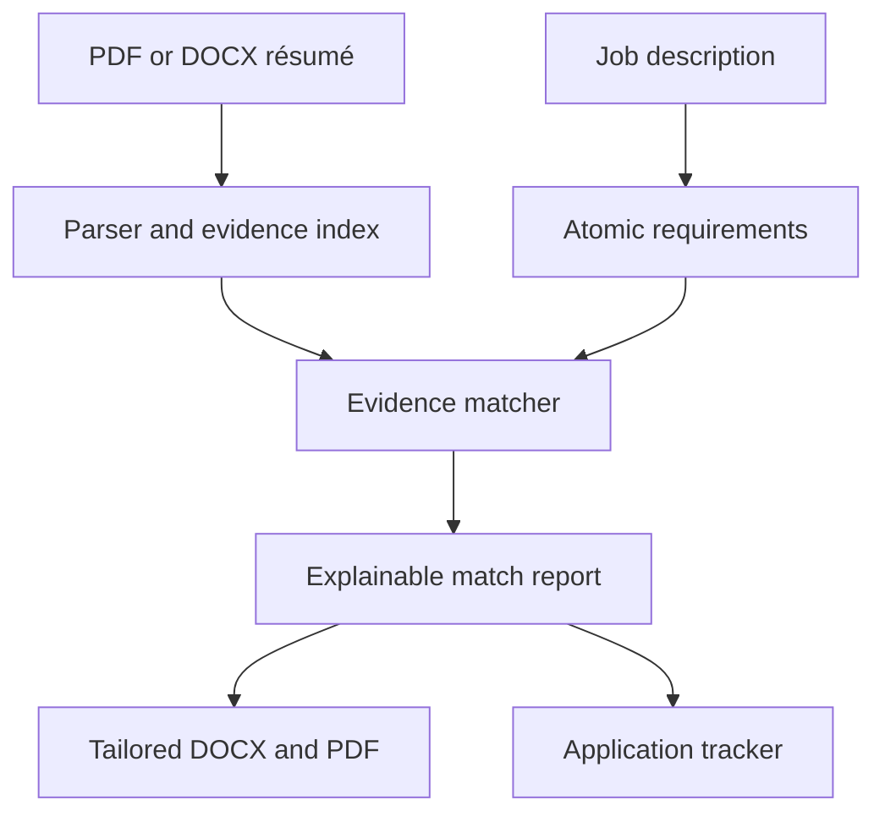

<div align="center">

# HireSense AI

### Evidence-first résumé matching for clearer, stronger applications

HireSense AI turns a résumé and job description into a transparent requirement-by-requirement match report, an evidence-grounded improvement plan, and a professionally formatted tailored résumé.

[](https://hiresense-ai-shro.streamlit.app/)
[](https://www.python.org/)
[](https://streamlit.io/)

</div>


## Why HireSense?

Most résumé tools return a single opaque score or rewrite content without showing where their claims came from. HireSense is designed around a different principle: **every conclusion should be traceable to evidence in the candidate's résumé**.

The application decomposes a job description into individual requirements, retrieves the most relevant résumé excerpts, classifies the quality of each match, and explains the result. It can then improve presentation and keyword clarity without adding unsupported skills, credentials, or experience.

### What the product delivers

| Capability | What users receive |
|---|---|
| Job discovery | Targeted LinkedIn, Indeed, and Google Jobs search links by title and location |
| Résumé parsing | Structured text and evidence extracted from PDF or DOCX files |
| Requirement analysis | Atomic required and preferred qualifications organized by category |
| Explainable matching | Direct, related, uncertain, or missing classifications with exact résumé evidence |
| Improvement guidance | Recruiter-focused actions prioritized by impact and verification risk |
| Tailored résumé | Evidence-grounded Word and PDF versions with professional alignment and typography |
| Application tracking | Session-based tracking for job status, dates, scores, résumé version, and next actions |
| Report exports | Downloadable evidence-map CSV and match-report PDF |

## Product tour

### 1. Add a résumé and target job

Upload a PDF or DOCX résumé, paste the complete job description, and optionally identify the job title, company, and location. The main workflow remains available without an API key.


### 2. Review an explainable match report

HireSense displays:

- An overall weighted alignment score
- Separate required and preferred alignment scores
- Direct, related, uncertain, and missing requirement counts
- Category-level coverage for experience, tools, skills, education, leadership, and more
- The exact résumé excerpt supporting each assessment
- Confidence, reasoning, and evidence source for every requirement

### 3. Improve and export

The improvement plan distinguishes between clearer wording that can use existing evidence and claims that must be verified first. Users can generate an aligned tailored résumé, review every change, and download it as Word or PDF.

## How it works



1. **Parse** — extracts readable résumé text and identifies candidate evidence.
2. **Decompose** — converts the job description into independently testable requirements.
3. **Retrieve** — finds the strongest résumé excerpt for each requirement.
4. **Validate** — rejects unsupported certifications, named tools, frameworks, and metrics.
5. **Score** — applies a reproducible evidence and importance weighting formula.
6. **Explain** — presents the assessment, evidence, confidence, gaps, and recommended actions.
7. **Tailor** — improves supported content and produces aligned DOCX and PDF exports.

## Transparent scoring

Each requirement receives one evidence result:

| Evidence result | Credit | Interpretation |
|---|---:|---|
| Direct match | `1.00` | Specific résumé evidence directly supports the requirement |
| Related evidence | `0.65` | Relevant transferable evidence exists, but the match is not exact |
| Uncertain | `0.25` | Evidence is weak, ambiguous, or requires confirmation |
| Missing | `0.00` | No sufficiently specific supporting evidence was found |

Required requirements receive a weight of `2`; explicitly preferred requirements receive a weight of `1`.

```text
Match score = 100 × Σ(evidence credit × importance weight) / Σ(importance weight)
```

The overall score and category scores use the same calculation. There are no hidden category weights.

## Trust and safety design

- **Evidence before claims** — generated content must remain grounded in the uploaded résumé.
- **No fabricated qualifications** — missing or uncertain requirements are not added automatically.
- **Specificity guardrails** — named tools, frameworks, degrees, certifications, and numbers need explicit support.
- **Human review** — tailored documents are presented for review before use in an application.
- **Explainable output** — every match retains its assessment and source evidence.
- **Privacy-aware processing** — uploads remain in Streamlit session memory and are not deliberately written to local storage.

> HireSense is decision support. Its score is not an employer ATS score, a hiring decision, or legal or immigration advice.

## Operating modes

| Mode | API key | Behavior |
|---|---:|---|
| Deterministic | Not required | Local extraction, retrieval, matching, recommendations, and document export |
| Structured AI | Optional | Uses an OpenAI model for structured interpretation while retaining the same evidence guardrails |

When Structured AI mode is enabled, the job description and selected résumé excerpts are sent to the configured OpenAI API. Deterministic mode stays local to the running application session.

## Tailored résumé exports

The generated résumé formats are designed for recruiter readability and stable rendering:

- Letter-size page layout with balanced margins
- Clear name, contact, headline, and section hierarchy
- Consistent role and bullet indentation
- Real DOCX bullet numbering rather than decorative characters
- Embedded PDF fonts for reliable spacing across viewers
- Section-heading and role orphan protection
- Candidate footer and automatic page numbering
- Selectable, ATS-readable text in both formats

## Technology stack

| Layer | Technology |
|---|---|
| Interface | Streamlit, HTML, responsive CSS, accessible motion |
| Application | Python 3.12 |
| Data handling | Dataclasses, deterministic retrieval and validation logic |
| AI integration | Optional OpenAI structured generation |
| Résumé input | pypdf, python-docx |
| Document output | python-docx, ReportLab |
| Reporting | pandas, CSV, PDF |
| Hosting | GitHub and Streamlit Community Cloud |

## Run locally

### 1. Clone the repository

```bash
git clone https://github.com/shroB97/Hiresense-AI.git
cd Hiresense-AI
```

### 2. Create and activate a virtual environment

macOS or Linux:

```bash
python -m venv .venv
source .venv/bin/activate
```

Windows PowerShell:

```powershell
python -m venv .venv
.venv\Scripts\Activate.ps1
```

### 3. Install and run

```bash
python -m pip install -r requirements.txt
streamlit run streamlit_app.py
```

Open the local URL displayed by Streamlit, normally `http://localhost:8501`.

## Optional OpenAI configuration

The application works without an API key. To enable Structured AI mode locally, create `.streamlit/secrets.toml`:

```toml
OPENAI_API_KEY = "your-api-key"
OPENAI_MODEL = "gpt-4.1-mini"
```

Never commit `.streamlit/secrets.toml`, `.env`, API keys, or other credentials. For Streamlit Community Cloud, configure secrets in the app's settings.

## Deploy to Streamlit Community Cloud

1. Fork this repository or push it to your GitHub account.
2. Sign in to [Streamlit Community Cloud](https://share.streamlit.io/).
3. Create an app from the repository.
4. Select `main` as the branch.
5. Select `streamlit_app.py` as the entrypoint.
6. Add optional secrets through Streamlit's settings.
7. Deploy.

## For recruiters and technical reviewers

This project demonstrates practical product engineering across several layers:

- End-to-end AI-assisted application design and deployment
- Explainable retrieval and requirement-level scoring
- Defensive validation against unsupported model output
- PDF and DOCX parsing and professional document generation
- Session-state workflow and editable application tracking
- Responsive UI design with accessible animations
- Privacy-aware optional AI integration
- Public deployment with a no-key deterministic fallback

The most important design decision is that AI interpretation is never treated as résumé evidence. Evidence must come from the candidate's uploaded document, making the workflow more transparent and reviewable.

## Current limitations

- Scanned PDFs need OCR text before upload.
- Application-tracker data is session-based and is not stored in a database.
- Match quality depends on the completeness of the résumé and job description.
- Users must verify all generated wording before submitting an application.
- Hiring outcomes and employer ATS behavior cannot be predicted or guaranteed.

## Links

- **Live application:** [hiresense-ai-shro.streamlit.app](https://hiresense-ai-shro.streamlit.app/)
- **Source code:** [github.com/shroB97/Hiresense-AI](https://github.com/shroB97/Hiresense-AI)

---

<div align="center">

Built to make résumé matching more transparent, evidence-based, and useful.

</div>
